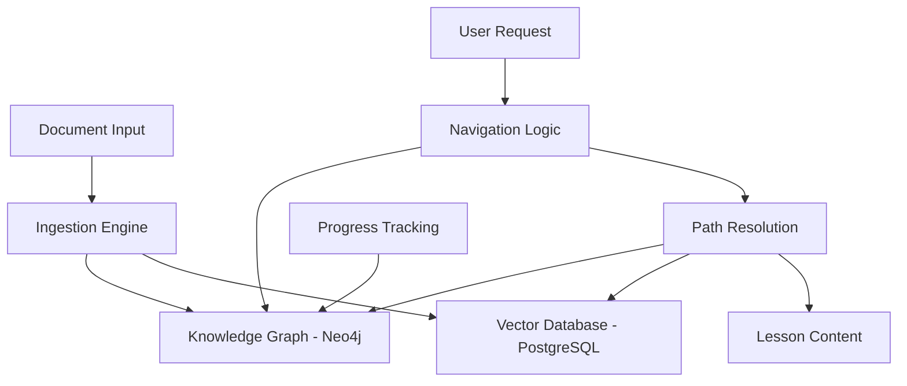

# Design Document: LearnFast Core Engine

## Overview

The LearnFast Core Engine implements a hybrid Graph-RAG architecture that separates structural reasoning from content retrieval. The system uses Neo4j for knowledge graph operations (the "Map") and PostgreSQL with pgvector for content storage and retrieval (the "Library"). This separation enables efficient pathfinding through learning concepts while maintaining fast content access through vector similarity search.

The core innovation is the two-pass structured extraction approach: first extracting conceptual relationships through LLM analysis, then storing content chunks with semantic embeddings. This ensures that learning paths are logically coherent while content retrieval remains contextually relevant.

## Architecture

### High-Level Components



### Technology Stack

- **Language**: Python 3.10+
- **Graph Database**: Neo4j v5+ with Graph Data Science (GDS) library
- **Vector Database**: PostgreSQL v16+ with pgvector extension
- **LLM Inference**: Ollama with `gpt-oss:20b-cloud` model for extraction and reasoning
- **Embeddings**: Ollama with `embeddinggemma:latest` model for vector embeddings
- **Document Processing**: markitdown library (native, not Docker)
- **Schema Validation**: Pydantic for structured data extraction

### Deployment Architecture

The system uses Docker Compose for local development with three core services:
- PostgreSQL with pgvector for vector operations
- Neo4j with APOC and GDS plugins for graph algorithms
- Ollama for local LLM inference

## Components and Interfaces

### Ingestion Engine

**Purpose**: Converts raw documents into structured graph nodes and vector embeddings

**Key Classes**:
```python
class IngestionEngine:
    def process_document(self, file_path: str) -> None
    def extract_graph_structure(self, markdown: str) -> GraphSchema
    def store_graph_data(self, schema: GraphSchema) -> None
    def store_vector_data(self, content: str, concept: str) -> None

class DocumentProcessor:
    def convert_to_markdown(self, file_path: str) -> str
    def chunk_content(self, markdown: str) -> List[str]
```

**Interfaces**:
- Input: PDF, DOCX, HTML files
- Output: Neo4j concept nodes and relationships, PostgreSQL content chunks with embeddings

### Navigation Logic

**Purpose**: Determines available learning options based on user progress and graph structure

**Key Classes**:
```python
class NavigationEngine:
    def find_root_concepts(self) -> List[str]
    def get_path_preview(self, root_concept: str, depth: int = 3) -> List[str]
    def find_unlocked_concepts(self, user_id: str) -> List[str]
    def validate_prerequisites(self, user_id: str, concept: str) -> bool

class UserProgressTracker:
    def mark_in_progress(self, user_id: str, concept: str) -> None
    def mark_completed(self, user_id: str, concept: str) -> None
    def get_user_state(self, user_id: str) -> UserState
```

**Interfaces**:
- Input: User ID, concept names
- Output: Available concepts, learning paths, progress status

### Path Resolution

**Purpose**: Generates time-constrained learning sequences and retrieves content

**Key Classes**:
```python
class PathResolver:
    def resolve_path(self, user_id: str, target: str, time_budget: int) -> List[str]
    def estimate_learning_time(self, concepts: List[str]) -> int
    def prune_path_by_time(self, path: List[str], time_limit: int) -> List[str]

class ContentRetriever:
    def get_lesson_content(self, path_concepts: List[str]) -> str
    def retrieve_chunks_by_concept(self, concept: str) -> List[str]
    def format_lesson(self, content_chunks: List[str]) -> str
```

**Interfaces**:
- Input: User ID, target concept, time budget
- Output: Optimized learning path, formatted lesson content

## Data Models

### Neo4j Graph Schema

**Nodes**:
```cypher
// Concept nodes with metadata
(:Concept {
    name: String (UNIQUE),
    description: String,
    depth_level: Integer
})

// User nodes for progress tracking
(:User {
    uid: String (UNIQUE),
    name: String
})
```

**Relationships**:
```cypher
// Prerequisite dependencies with reasoning
(:Concept)-[:PREREQUISITE {
    weight: Float,      // 0.0-1.0 dependency strength
    reasoning: String   // Why this prerequisite is needed
}]->(:Concept)

// User progress tracking
(:User)-[:COMPLETED {
    finished_at: DateTime
}]->(:Concept)

(:User)-[:IN_PROGRESS {
    started_at: DateTime
}]->(:Concept)
```

### PostgreSQL Schema

```sql
CREATE TABLE learning_chunks (
    id SERIAL PRIMARY KEY,
    doc_source TEXT NOT NULL,           -- Source filename or URL
    content TEXT NOT NULL,              -- Markdown text chunk
    embedding vector(1024) NOT NULL,    -- Semantic embedding from embeddinggemma:latest
    concept_tag TEXT NOT NULL           -- Links to Neo4j Concept.name
);

-- Efficient vector similarity search
CREATE INDEX ON learning_chunks USING hnsw (embedding vector_cosine_ops);

-- Fast concept-based retrieval
CREATE INDEX ON learning_chunks (concept_tag);
```

### Pydantic Models

```python
class PrerequisiteLink(BaseModel):
    source_concept: str = Field(..., description="The fundamental concept")
    target_concept: str = Field(..., description="The advanced concept")
    weight: float = Field(..., ge=0.0, le=1.0, description="Dependency strength")
    reasoning: str = Field(..., description="Why source is needed for target")

class GraphSchema(BaseModel):
    concepts: List[str] = Field(..., description="List of extracted concepts")
    prerequisites: List[PrerequisiteLink] = Field(..., description="Concept dependencies")

class UserState(BaseModel):
    user_id: str
    completed_concepts: List[str]
    in_progress_concepts: List[str]
    available_concepts: List[str]
```

## Error Handling

### Document Processing Errors
- **Invalid file formats**: Return clear error messages with supported format list
- **Conversion failures**: Log detailed error information and provide fallback processing
- **Empty documents**: Handle gracefully with appropriate user feedback

### LLM Extraction Errors
- **Invalid JSON responses**: Retry with modified prompts, validate with Pydantic
- **Missing required fields**: Use default values where appropriate, request re-extraction
- **Malformed concept names**: Normalize and sanitize before storage

### Database Errors
- **Connection failures**: Implement retry logic with exponential backoff
- **Constraint violations**: Handle duplicate concepts gracefully with MERGE operations
- **Vector dimension mismatches**: Validate embedding dimensions before storage

### Path Resolution Errors
- **No valid paths**: Suggest alternative starting points or intermediate goals
- **Time estimation failures**: Use default time estimates with user warnings
- **Content retrieval failures**: Provide partial content with error notifications

## Testing Strategy

### Unit Testing Framework
- **Framework**: pytest for Python testing
- **Coverage**: Aim for 80%+ code coverage on core logic
- **Mocking**: Use pytest-mock for external dependencies (databases, LLM APIs)

### Property-Based Testing Framework
- **Framework**: Hypothesis for Python property-based testing
- **Configuration**: Minimum 100 iterations per property test
- **Integration**: Each property test will reference specific correctness properties from this design document

### Test Categories

**Unit Tests**:
- Document conversion and chunking logic
- Graph extraction and validation
- Database connection and query operations
- Path resolution algorithms
- Content formatting and retrieval

**Integration Tests**:
- End-to-end document ingestion workflow
- User progress tracking across sessions
- Path resolution with real graph data
- Vector similarity search accuracy

**Property-Based Tests**:
- Universal properties that must hold across all valid inputs
- Each property test tagged with format: `**Feature: learnfast-core-engine, Property {number}: {property_text}**`
- Properties validate correctness requirements from acceptance criteria